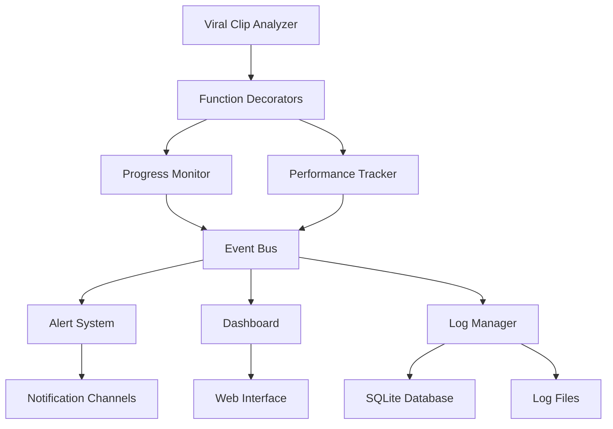

# Design Document: Viral Clip Analyzer Progress Monitoring System

## Overview

The progress monitoring and logging system will be implemented as a comprehensive observability layer that wraps around the existing viral clip analyzer. The system uses a decorator-based approach for function tracking, event-driven architecture for real-time updates, and structured logging for data persistence. The design emphasizes minimal performance overhead while providing maximum visibility into system operations.

## Architecture

The system follows a modular architecture with clear separation of concerns:



**Core Components:**
- **Function Decorators**: Lightweight wrappers that capture execution data
- **Event Bus**: Central message broker for real-time communication
- **Progress Monitor**: Tracks execution state and progress
- **Performance Tracker**: Collects and analyzes performance metrics
- **Log Manager**: Handles structured logging and data persistence
- **Alert System**: Manages notifications and threshold monitoring
- **Dashboard**: Web-based interface for visualization

## Components and Interfaces

### Function Decorators

```python
@monitor_execution
@track_performance
def fetch_trending_clips(platform='youtube', limit=100):
    # Existing function implementation
    pass
```

**Interface:**
- `@monitor_execution`: Captures function calls, parameters, results, and errors
- `@track_performance`: Measures execution time, memory usage, and resource consumption
- `@progress_step(weight=1.0)`: Marks functions as progress steps with relative weights

### Progress Monitor

```python
class ProgressMonitor:
    def start_session(self, session_id: str, total_steps: int) -> None
    def update_progress(self, session_id: str, step: str, progress: float) -> None
    def complete_session(self, session_id: str, summary: Dict) -> None
    def get_current_progress(self, session_id: str) -> ProgressState
```

**Responsibilities:**
- Track execution progress across multiple functions
- Calculate estimated completion times
- Maintain session state for batch operations
- Emit progress events to the event bus

### Performance Tracker

```python
class PerformanceTracker:
    def record_execution(self, func_name: str, duration: float, memory_peak: int) -> None
    def record_api_call(self, endpoint: str, response_time: float, status: int) -> None
    def record_db_operation(self, query_type: str, duration: float, rows: int) -> None
    def get_performance_summary(self, time_range: TimeRange) -> PerformanceSummary
```

**Metrics Collected:**
- Function execution times and memory usage
- API response times and success rates
- Database query performance
- System resource utilization
- Error rates and patterns

### Event Bus

```python
class EventBus:
    def publish(self, event_type: str, data: Dict) -> None
    def subscribe(self, event_type: str, handler: Callable) -> None
    def unsubscribe(self, event_type: str, handler: Callable) -> None
```

**Event Types:**
- `function.started`, `function.completed`, `function.failed`
- `progress.updated`, `session.started`, `session.completed`
- `performance.threshold_exceeded`, `error.rate_high`
- `system.startup`, `system.shutdown`

### Log Manager

```python
class LogManager:
    def log_execution(self, func_name: str, params: Dict, result: Any, duration: float) -> None
    def log_error(self, func_name: str, error: Exception, context: Dict) -> None
    def log_performance(self, metrics: PerformanceMetrics) -> None
    def query_logs(self, filters: LogFilters) -> List[LogEntry]
    def export_data(self, format: str, time_range: TimeRange) -> str
```

**Storage Strategy:**
- SQLite database for structured data and fast queries
- Rotating log files for detailed text logs
- JSON format for structured log entries
- Automatic cleanup of old data based on retention policies

## Data Models

### LogEntry

```python
@dataclass
class LogEntry:
    timestamp: datetime
    session_id: str
    function_name: str
    event_type: str  # 'start', 'complete', 'error'
    duration: Optional[float]
    parameters: Dict[str, Any]
    result_summary: Optional[str]
    error_details: Optional[str]
    memory_usage: Optional[int]
    metadata: Dict[str, Any]
```

### PerformanceMetrics

```python
@dataclass
class PerformanceMetrics:
    timestamp: datetime
    function_name: str
    execution_time: float
    memory_peak: int
    cpu_usage: float
    api_calls_count: int
    db_queries_count: int
    success_rate: float
```

### ProgressState

```python
@dataclass
class ProgressState:
    session_id: str
    current_step: str
    progress_percentage: float
    estimated_completion: datetime
    steps_completed: int
    total_steps: int
    start_time: datetime
    errors_encountered: int
```

### AlertConfiguration

```python
@dataclass
class AlertConfiguration:
    name: str
    condition: str  # Python expression
    threshold: float
    time_window: int  # minutes
    notification_channels: List[str]
    enabled: bool
    cooldown_period: int  # minutes
```

## Error Handling

The system implements comprehensive error handling with graceful degradation:

**Monitoring Failures:**
- If logging fails, the system continues operation without monitoring
- Failed log writes are queued and retried with exponential backoff
- Critical errors are logged to a separate emergency log file

**Performance Impact:**
- Monitoring overhead is limited to <5% of total execution time
- Asynchronous logging prevents blocking main operations
- Circuit breaker pattern for external notification services

**Data Integrity:**
- Database transactions ensure consistent log entries
- Automatic recovery from corrupted log files
- Backup and restore capabilities for critical monitoring data

## Testing Strategy

The testing approach combines unit tests for individual components and property-based tests for system-wide correctness properties.

**Unit Testing:**
- Mock external dependencies (file system, database, network)
- Test individual decorator functionality
- Verify event bus message routing
- Test alert threshold calculations
- Validate data export formats

**Property-Based Testing:**
- Test monitoring overhead remains within acceptable limits
- Verify log data consistency across different execution paths
- Test system behavior under various error conditions
- Validate performance metric calculations
- Test configuration changes don't break existing functionality

**Integration Testing:**
- End-to-end testing with the actual viral clip analyzer
- Performance testing under realistic workloads
- Stress testing with high error rates
- Testing alert system with various notification channels

## Correctness Properties

*A property is a characteristic or behavior that should hold true across all valid executions of a system-essentially, a formal statement about what the system should do. Properties serve as the bridge between human-readable specifications and machine-verifiable correctness guarantees.*

### Property 1: Comprehensive Function Logging
*For any* function execution in the system, the Progress_Monitor should log the function name, parameters, timestamp, and outcome (success with execution time and result summary, or failure with error details and stack trace)
**Validates: Requirements 1.1, 1.2, 1.3**

### Property 2: Progress Tracking Consistency
*For any* batch processing session, the Progress_Monitor should maintain consistent progress percentages that increase monotonically from 0% to 100% and provide reasonable estimated completion times
**Validates: Requirements 1.4**

### Property 3: Structured Log Storage
*For any* log entry created by the system, the Log_Manager should store it in a structured format with searchable metadata and all required fields present
**Validates: Requirements 1.5**

### Property 4: Universal Performance Tracking
*For any* system operation (clip processing, API calls, database operations, memory-intensive tasks), the Performance_Tracker should measure and log the relevant performance metrics (execution time, response time, memory usage, etc.)
**Validates: Requirements 2.1, 2.2, 2.3, 2.4**

### Property 5: Performance Aggregation Accuracy
*For any* set of performance data points, the Performance_Tracker should calculate daily, weekly, and monthly averages that mathematically match the underlying data
**Validates: Requirements 2.5**

### Property 6: Real-time Dashboard Updates
*For any* system state change (progress updates, errors, completions), the Dashboard should reflect the change within 5 seconds and display accurate information without requiring manual refresh
**Validates: Requirements 3.1, 3.2, 3.3, 3.4, 3.5**

### Property 7: Alert Timing Compliance
*For any* alert condition that is met, the Alert_System should send notifications within the specified time limits (2 minutes for fetch failures, immediate for threshold breaches)
**Validates: Requirements 4.1, 4.2, 4.3**

### Property 8: Alert Delivery Completeness
*For any* alert that should be sent, the Alert_System should successfully deliver it to all configured notification channels (email, webhook, file logging)
**Validates: Requirements 4.4, 4.5**

### Property 9: Historical Data Retrieval Accuracy
*For any* date range query, the Log_Manager should return all and only the performance metrics that fall within the specified time period
**Validates: Requirements 5.1**

### Property 10: Trend Calculation Correctness
*For any* performance data over time, the Performance_Tracker should calculate trends (regression/improvement) that accurately reflect the mathematical relationship in the data
**Validates: Requirements 5.2**

### Property 11: Data Export Completeness
*For any* data export request, the Log_Manager should provide complete data in the requested format (CSV or JSON) with all relevant metrics, timestamps, and metadata included
**Validates: Requirements 5.4, 7.2**

### Property 12: Data Retention Policy Compliance
*For any* point in time, the system should retain detailed logs for at least 90 days and summary data for at least 1 year from that point
**Validates: Requirements 5.5**

### Property 13: Configuration Hot-reload Effectiveness
*For any* configuration change (log levels, alert thresholds, monitoring features, performance targets), the system should apply the new settings immediately without requiring restart and without affecting ongoing operations
**Validates: Requirements 6.1, 6.2, 6.3, 6.4**

### Property 14: Configuration Validation Completeness
*For any* configuration file provided to the system, the startup process should validate all settings and either accept valid configurations or reject invalid ones with clear error messages
**Validates: Requirements 6.5**

### Property 15: Report Generation Completeness
*For any* report generation request (daily summaries, trend analysis, custom reports), the system should include all relevant data points and metadata specified for that report type
**Validates: Requirements 7.1, 7.3, 7.4**

### Property 16: Automated Report Scheduling
*For any* weekly time period, the system should automatically generate and save a performance report in PDF format without manual intervention
**Validates: Requirements 7.5**

### Property 17: Dashboard Filtering Accuracy
*For any* filter applied to dashboard reports (date range, function, performance metrics), the displayed results should include all and only the data that matches the filter criteria
**Validates: Requirements 7.4**